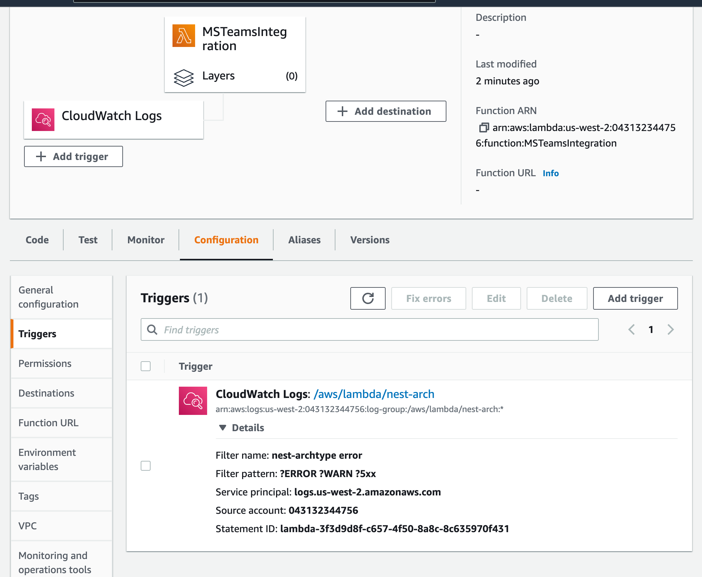
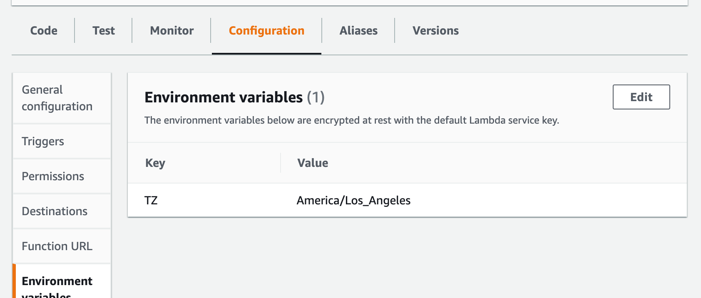

# Add a trigger with CloudWatch log group

# To report timestamp in the current timezone
"TZ – The environment's time zone (UTC). The execution environment uses NTP to synchronize the system clock." from [here](https://docs.aws.amazon.com/lambda/latest/dg/configuration-envvars.html)

